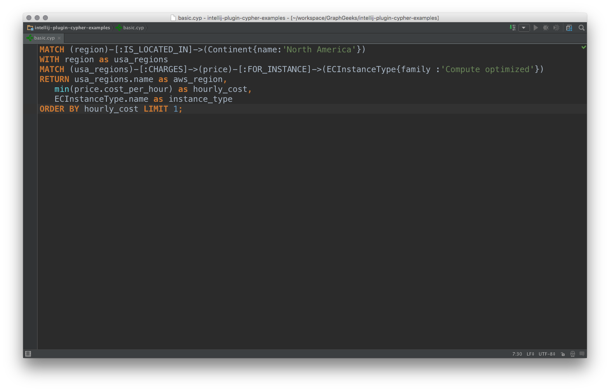

Cypher Intellij Plugin
======================

Plugin provides [Cypher](http://www.opencypher.org/) language support for IntelliJ IDE.

It will use files with `.cyp` extension.
Also Cypher language can be injected in any string (i.e. in Java).

## Installation

**Manual:**

1. Navigate to [releases](https://github.com/FylmTM/intellij-plugin-cypher/releases) page.
2. Pick most recent release.
3. Download `Cypher.zip` file.
4. Go to your Intellij IDE preferences `Plugins` -> `Install plugin from disk...`.
5. Select downloaded plugin.
6. Restart IDE.

## Known issues

* Using keyword or function name, as variable will break lexer.
* Error description is not really usable (internal naming).

## Screenshots

## Development

Gradle is used as build system. 

**Run Idea to test plugin:** `gradle runIdea`

#### Grammar

Cypher grammar is located here - `src/main/java/com/neueda4j/intellij/plugin/cypher/lexer/Cypher.bnf`

After grammar change:

* Generate parser code for grammar
* Generate jFlex `.lexer` for grammar
* Generate lexer code from `.lexer`

